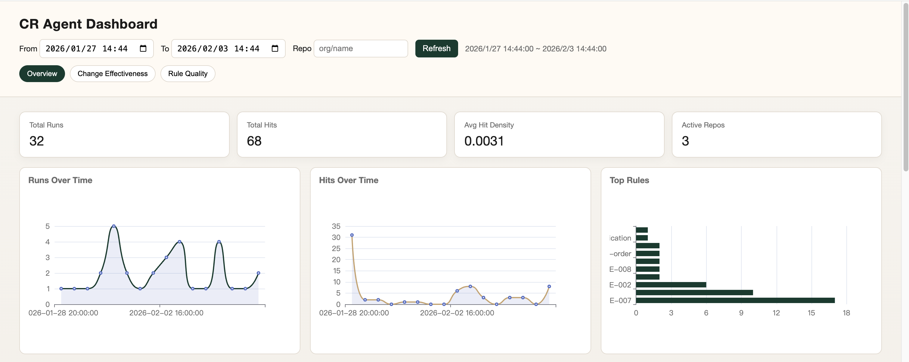

# CR Agent Server

这是一个轻量级的 Go 服务，用于接收代码评审 Agent 的运行指标，写入 MySQL，并提供仪表盘与分析接口。

**功能概述**
- 接收并落库 Agent 运行指标，支持 `(repo, code_change_id, agent_run_id)` 幂等写入
- 内置仪表盘页面（`/`）直接消费后端 API
- 提供汇总、时序、Top 规则、变更效果、规则质量等分析接口

**运行环境**
- Go 1.23+
- MySQL 5.7+ 

**快速开始**
1. 准备 MySQL，并创建数据库。
2. 修改 `config.yaml` 中的连接与日志配置。
3. 启动服务。

```bash
# 在仓库根目录
go run .
```

默认监听 `:8869`，打开 `http://localhost:8869/` 查看仪表盘。

**配置说明**
服务从工作目录读取 `config.yaml`。示例：

```yaml
server:
  addr: ":8869"

logging:
  file: "./log/cr-agent-server.log"

mysql:
  host: "127.0.0.1"
  port: 3306
  user: "user"
  pass: "password"
  db_name: "cr-agent"
```

说明：
- `server.addr` 为空时默认 `:8869`
- `logging.file` 为空时默认 `gin.log`
- 时间统一以 UTC 存储

**数据库**
服务依赖如下三张表，结构与 `db.go` 中的 Gorm 模型一致：
- `cr_agent_run`
- `cr_agent_run_rule`
- `code_change_summary`

**文档**
- [API 说明](doc/api.md)

**图示**


**构建**
```bash
go build -o cr-agent-server .
```
